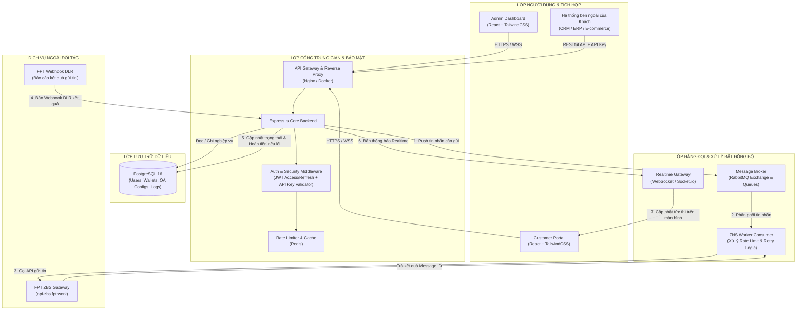
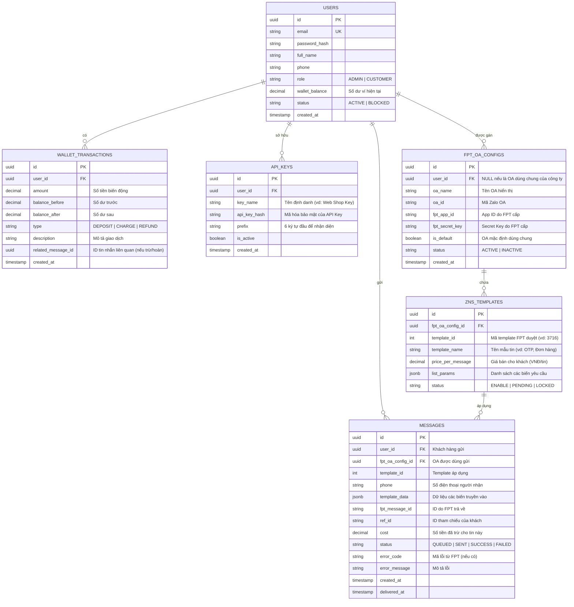

# TÀI LIỆU KIẾN TRÚC HỆ THỐNG VÀ CÔNG NGHỆ (SYSTEM SPECIFICATION)
## DỰ ÁN: NỀN TẢNG CHO THUÊ VÀ QUẢN LÝ DỊCH VỤ ZALO NOTIFICATION SERVICE (ZNS RESELLER PLATFORM)

---

## 1. TỔNG QUAN HỆ THỐNG (SYSTEM OVERVIEW)

### 1.1. Mục tiêu
Xây dựng nền tảng phần mềm trung gian (ZNS Reseller / Aggregator Gateway) kết nối trực tiếp với cổng **FPT ZBS Gateway (`api-zbs.fpt.work`)**. Hệ thống cho phép:
* **Ban Quản trị (Admin / Sếp):** Quản lý đối tác khách hàng, cấu hình gán `app-id` và `secret-key` từ FPT cho từng khách hàng (hoặc sử dụng OA chung công ty), thiết lập đơn giá tin nhắn, duyệt nạp tiền ví, theo dõi hạn mức Quota và lợi nhuận.
* **Khách hàng thuê dịch vụ (Customer / Doanh nghiệp):** Đăng nhập cổng Portal, nạp tiền ví, quản lý mã API Key riêng, theo dõi số dư ví, gửi tin chiến dịch (bằng file Excel) hoặc tích hợp API gửi tin tự động từ website/phần mềm bán hàng của họ, tra cứu báo cáo trạng thái gửi tin theo thời gian thực.

### 1.2. Phân hệ người dùng & Vai trò
| Phân hệ | Đối tượng | Chức năng chính |
| :--- | :--- | :--- |
| **Admin Portal** | Ban Quản trị / Sếp | • Quản lý danh sách khách hàng thuê<br>• Cấu hình OA (`OA ID`, `FPT App ID`, `FPT Secret Key`)<br>• Cài đặt đơn giá bán cho từng loại Template<br>• Quản lý giao dịch nạp tiền ví, đối soát cước FPT<br>• Giám sát hàng đợi gửi tin & Quota tổng |
| **Customer Portal** | Khách hàng thuê | • Quản lý thông tin tài khoản & xem số dư ví<br>• Tạo và quản lý `API Key` của hệ thống<br>• Xem danh mục Mẫu tin nhắn (Template) được phép gửi<br>• Gửi tin ZNS qua giao diện (Upload file Excel)<br>• Theo dõi trạng thái tin nhắn Realtime (Thành công / Thất bại)<br>• Báo cáo & Lịch sử biến động số dư |
| **API Gateway & Worker** | Tích hợp hệ thống | • API nhận lệnh gửi tin từ khách hàng<br>• Kiểm tra hạn mức, xác thực API Key, kiểm tra số dư ví<br>• Đẩy tin vào hàng đợi RabbitMQ<br>• Worker lấy tin và chuyển tiếp sang FPT ZBS API<br>• Webhook tiếp nhận DLR từ FPT và hoàn tiền ví tự động nếu tin lỗi |

---

## 2. SƠ ĐỒ KIẾN TRÚC TỔNG THỂ (ARCHITECTURE BLUEPRINT)



---

## 3. DANH MỤC CÔNG NGHỆ LỰA CHỌN (TECH STACK)

### 3.1. Frontend: React 18 + TailwindCSS
* **Core Framework:** React 18 (Khởi tạo nhanh và tối ưu bằng **Vite**).
* **Styling:** **TailwindCSS (v3.4)** kết hợp cấu hình theme bảng màu chuẩn UI/UX doanh nghiệp.
* **Thư viện Icon:** **Lucide React** (Bộ icon SVG hiện đại, nét mảnh mềm mại, chuẩn ứng dụng cao cấp).
* **Quản lý State & Gọi API:** **TanStack Query (React Query v5)** + **Axios** (Hỗ trợ cache dữ liệu client, tự động fetch lại, xử lý interceptor đính kèm JWT Token và tự refresh token khi hết hạn).
* **Thời gian thực (Realtime):** **Socket.io-client** (Nhận thông báo trạng thái tin nhắn gửi thành công/thất bại mà không cần F5 tải lại trang).
* **Bảng dữ liệu & Biểu đồ:** TanStack Table (xử lý danh sách hàng nghìn tin nhắn phân trang mượt mà) + Recharts (biểu đồ thống kê lượng tin).

### 3.2. Backend: Node.js + Express.js
* **Runtime:** Node.js (phiên bản LTS v20+).
* **Web Framework:** Express.js (Kiến trúc Modular MVC / Clean Architecture).
* **Xác thực & Phân quyền (Auth):**
  * **JWT (JSON Web Token):** Chuẩn kép gồm `AccessToken` (thời hạn ngắn 15 phút) và `RefreshToken` (lưu an toàn trong Cookie `HttpOnly` hoặc Redis).
  * **API Key Middleware:** Dành riêng cho máy chủ của khách hàng gọi API gửi tin (kiểm tra hash key, kiểm tra trạng thái kích hoạt).
* **Bảo vệ hệ thống & Rate Limiting:**
  * `helmet` (Bảo mật HTTP header).
  * `express-rate-limit` kết hợp **Redis Store** (chống spam, chống tấn công brute-force theo từng IP và từng API Key).
* **Quản lý biến môi trường:** `dotenv` + `joi` / `zod` để validate biến môi trường ngay khi khởi động server, tuyệt đối không hardcode.

### 3.3. Cơ sở dữ liệu: PostgreSQL 16
* **Hệ quản trị CSDL:** PostgreSQL 16 (Hỗ trợ xử lý giao dịch ACID nghiêm ngặt cho nghiệp vụ Ví tiền và kiểu dữ liệu JSONB cực kỳ phù hợp để lưu trữ biến động `template_data` của tin ZNS).
* **ORM / Query Builder:** **Prisma ORM** (Đảm bảo Type-safety, tự sinh Migration, dễ bảo trì và tối ưu truy vấn).

### 3.4. Hàng đợi thông điệp: RabbitMQ
* **Message Broker:** RabbitMQ 3 (kết nối qua thư viện `amqplib`).
* **Lý do bắt buộc phải có RabbitMQ:**
  * **Chống nghẽn & Đứt gãy hệ thống:** Khi khách hàng tải lên file Excel 10.000 số điện thoại hoặc nhiều khách cùng gọi API gửi OTP đồng thời, nếu gửi đồng bộ (Synchronous) server sẽ bị treo hoặc FPT sẽ chặn vì quá tải.
  * **Rate Limiting phía FPT:** FPT quy định tốc độ nhận request (TPS - Transactions Per Second). RabbitMQ Worker sẽ điều tiết tốc độ nhả tin đều đặn theo đúng hạn mức cho phép của FPT.
  * **Cơ chế Retry & Dead Letter Queue (DLQ):** Nếu mạng sang FPT chập chờn, tin nhắn không bị mất mà được giữ lại trong queue và tự động thử lại sau vài giây.

### 3.5. Bộ nhớ đệm & Caching: Redis 7
* Caching thông tin cấu hình OA, thông tin Template để không phải truy vấn lại Database liên tục mỗi khi có tin gửi đến.
* Lưu trữ phiên làm việc (Session / Blacklist Token / Refresh Token).
* Lưu trữ bộ đếm cho Rate Limiting.

### 3.6. Triển khai & Đóng gói: Docker & Docker Compose
* Đóng gói toàn bộ hệ thống trong 1 tệp `docker-compose.yml`:
  1. `db_postgres`: Lưu trữ dữ liệu.
  2. `broker_rabbitmq`: Hàng đợi tin nhắn.
  3. `cache_redis`: Bộ nhớ đệm và Rate limit.
  4. `app_backend`: Ứng dụng Express.js API & Worker.
  5. `app_frontend`: Ứng dụng React build sẵn phục vụ qua Nginx.

---

## 4. THIẾT KẾ CƠ SỞ DỮ LIỆU CỐT LÕI (DATABASE SCHEMA)



---

## 5. QUY TRÌNH NGHIỆP VỤ CHI TIẾT (WORKFLOWS)

### 5.1. Luồng Khách hàng gửi tin qua API (Asynchronous High-Throughput)
1. Khách hàng gửi request HTTP POST đến `/api/v1/zns/send` (kèm Header `x-api-key`).
2. **Middleware:** Xác thực API Key $\rightarrow$ Kiểm tra Rate Limit trên Redis.
3. **Billing Check:** Tính toán chi phí tin nhắn $\rightarrow$ Kiểm tra số dư ví trong DB (Nếu số dư < giá tin $\rightarrow$ Trả về lỗi `402 Payment Required`).
4. **Tạm giữ tiền:** Trừ tạm ứng tiền trong ví và tạo bản ghi tin nhắn ở trạng thái `QUEUED`.
5. **Đẩy vào hàng đợi:** Đẩy payload tin nhắn vào RabbitMQ (`zns_send_queue`). Ngay lập tức trả về phản hồi `202 Accepted` cho khách kèm `tracking_id` (Tốc độ phản hồi < 50ms).
6. **Worker xử lý:** Worker nhặt tin từ RabbitMQ $\rightarrow$ Lấy đúng `fpt_app_id` và `fpt_secret_key` của khách $\rightarrow$ Gọi API FPT (`https://api-zbs.fpt.work/api/send-message`).
7. **Cập nhật:** Nhận phản hồi tức thời từ FPT lưu lại `fpt_message_id`.

### 5.2. Luồng Webhook DLR từ FPT & Hoàn tiền tự động (Delivery Report)
1. FPT gửi thông báo kết quả gửi tin về Endpoint: `POST /api/v1/webhook/fpt-dlr`.
2. Hệ thống tìm bản ghi tin nhắn theo `msg_id`.
3. Cập nhật trạng thái:
   * **Nếu thành công (`status: 1`):** Chuyển trạng thái sang `SUCCESS`.
   * **Nếu thất bại (`status: -1`):** Chuyển trạng thái sang `FAILED`, ghi nhận mã lỗi FPT, **tự động hoàn tiền vào ví khách hàng** (`REFUND`) và tạo log giao dịch.
4. Phát thông báo WebSocket (Socket.io) đến phiên làm việc của khách để giao diện Dashboard cập nhật trạng thái ngay trước mắt người dùng.

---

## 6. QUY CHUẨN THIẾT KẾ GIAO DIỆN (UI/UX GUIDELINES)

Giao diện Portal được thiết kế theo tiêu chuẩn phần mềm SaaS B2B hiện đại, tuân thủ nghiêm ngặt các quy tắc:
* **Hệ màu chức năng chuẩn hành vi UX:**
  * **Nút hành động chính (Lưu, Xác nhận, Tạo mới, Nạp tiền):** Nền xanh dương hoặc xanh lá (`bg-emerald-600 hover:bg-emerald-700 text-white`), bo góc mềm mại, đổ bóng nhẹ.
  * **Nút hành động rủi ro / nguy hiểm (Xóa, Hủy, Khóa tài khoản):** Nền đỏ (`bg-rose-600 hover:bg-rose-700 text-white`).
  * **Nút phụ (Đóng, Quay lại, Xuất file):** Nền trung tính (`bg-slate-100 text-slate-700 hover:bg-slate-200`).
* **Trạng thái & Thẻ Tag (Badges):**
  * Thành công: Chữ xanh lá nền xanh nhạt (`text-emerald-700 bg-emerald-50 border-emerald-200`).
  * Thất bại / Lỗi: Chữ đỏ nền đỏ nhạt (`text-rose-700 bg-rose-50 border-rose-200`).
  * Đang xử lý / Chờ gửi: Chữ vàng cam nền cam nhạt (`text-amber-700 bg-amber-50 border-amber-200`).
* **Icon & Chữ viết:**
  * 100% sử dụng icon SVG sắc nét từ `lucide-react`.
  * Văn phong giao diện ngắn gọn, đúng ngữ cảnh phần mềm tiếng Việt, không dùng ký tự lập trình hay gạch chân khó hiểu.
  * Đảm bảo Responsive chuẩn trên cả màn hình Desktop lớn, Laptop và Máy tính bảng.

---

## 7. CẤU TRÚC DỰ ÁN ĐỀ XUẤT (PROJECT DIRECTORY STRUCTURE)

```
zaloservices/
├── docker-compose.yml              # Khởi chạy Postgres, Redis, RabbitMQ, Backend, Frontend
├── .env.example                    # Mẫu cấu hình môi trường chuẩn
│
├── backend/                        # Ứng dụng Express.js API & Worker
│   ├── src/
│   │   ├── config/                 # Cấu hình DB, Redis, RabbitMQ, FPT Base URL
│   │   ├── controllers/            # Controller tiếp nhận HTTP request
│   │   ├── middlewares/            # Auth JWT, API Key, Rate Limiter, Error Handler
│   │   ├── models/ (hoặc prisma/)  # Prisma Schema & Migrations
│   │   ├── queues/                 # RabbitMQ Producer & Consumer Workers
│   │   ├── routes/                 # API Routes (Admin, Customer, ZNS, Webhook)
│   │   ├── services/               # Logic nghiệp vụ (WalletService, ZnsService, FptAdapter)
│   │   ├── sockets/                # Socket.io Realtime Server
│   │   └── server.js               # Entry point
│   ├── Dockerfile
│   └── package.json
│
└── frontend/                       # Ứng dụng React + TailwindCSS (Vite)
    ├── src/
    │   ├── components/             # Reusable UI (Buttons, Modal, Badges, Tables, Inputs)
    │   ├── layouts/                # AdminLayout, CustomerLayout (Sidebar, Header)
    │   ├── pages/
    │   │   ├── admin/              # Khách hàng, Cấu hình OA, Bảng giá, Doanh thu
    │   │   └── customer/           # Dashboard, Nạp tiền, API Keys, Chiến dịch, Báo cáo
    │   ├── services/               # API clients (Axios instance, Interceptors)
    │   ├── hooks/                  # Custom hooks (useSocket, useAuth)
    │   ├── App.jsx
    │   └── main.jsx
    ├── tailwind.config.js
    ├── Dockerfile
    └── package.json
```
